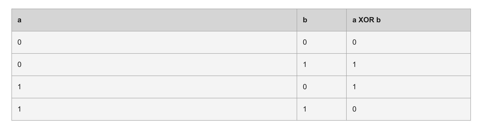

# JS

Ref:[MDN Web Docs](https://developer.mozilla.org/en-US/docs/Web/JavaScript/Reference/Operators/Bitwise_XOR)
XOR연산자는 ^로 실행하게 된다. 설명에 따르면 각 숫자를 비트로 나눠 쪼갠 뒤 각 비트끼리 같은 곳에 0, 다른곳에 1을 할당한 비트를 반환해준다.

```javascript
const a = 5; // 00000000000000000000000000000101
const b = 3; // 00000000000000000000000000000011

console.log(a ^ b); // 00000000000000000000000000000110
// expected output: 6
```



XOR연산자란 OR 연산을 바이트단위로 하는 건데 아래와 같은 사용법이 있다.

숫자 타입의 경우 같은 아래와 같이 세가지로 묶이게 되는 경우가 발생하고 문자인 경우 비교 시 무조건 0 이 뜨게 된다.

가장 중요한 포인트는 같은 숫자를 연산하는 경우 0이 나타난다는 것이다 :)

```javascript
console.log(1 ^ 2); // 3
console.log(1 ^ 3); // 2
console.log(2 ^ 3); // 1
```
