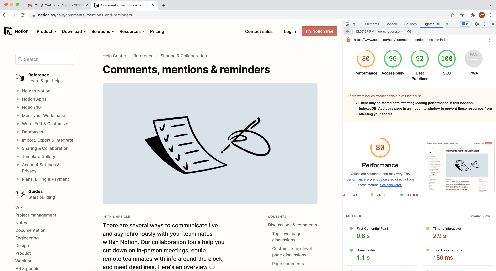

# Light house(Dev Tools)

## 1.[lighthouse#devtools](https://developers.google.com/web/tools/lighthouse#devtools)

퍼포먼스와, 접근성, PWA. SEO등을 평가해주는 자동화된 평가 툴이며 오픈소스임

## 2. 사용법

### 2.1 크롬 익스텐션

- [익스텐션](https://chrome.google.com/webstore/detail/lighthouse/blipmdconlkpinefehnmjammfjpmpbjk/related)
  

- Node Module
  [Using programmatically Way](https://github.com/GoogleChrome/lighthouse/blob/master/docs/readme.md#using-programmatically)

  ```javascript
  npm install -g lighthouse
  lighthouse <url>
  lighthouse -help
  ```
